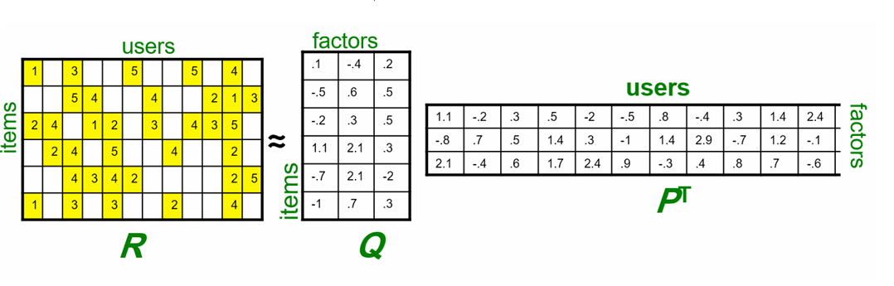

# Project — A Latent Factor Based Movie Recommender System
Notebook:
- project-latent-factor-based-recommender.ipynb (instructor/piloted)

## Overview
A from-scratch recommender built on pure linear-algebraic foundations and evaluated on the MovieLens-100K dataset. The notebook was piloted end-to-end  before handing it to students. The dataset is split 90%/10% into train/test with a per-user constraint so that every user appears in both splits (see the code) and predictions are always well-defined.

One of the main practical challenges addressed throughout is sparsity—the rating matrix is highly incomplete—and therefore how to handle missing data (unobserved user–movie ratings). The notebook contrasts several strategies: zero-fill vs. mean-centered residuals, z-score normalization, neighborhood models operating only on co-rated overlaps, and low-rank reconstructions via truncated SVD.

the SVD factors are mapped to the usual recommender notation $R \approx QP^\top$ with $Q=U_r$ and $P^\top=\Sigma_r V_r^\top$. Many concepts are started and analyzed here; while not all are carried to full theoretical depth, the notebook contains the essential clues and pointers to go further.

## Learning Objectives
- Build a **user–item utility matrix** and reason about sparsity patterns and their consequences.
- Implement baseline predictors under **missing data** (global mean, user/item bias).
- Compute **item–item** and **user–user** cosine similarities on co-rated sets and use them for neighborhood predictions.
- Derive and apply **truncated SVD** to obtain a **best rank-$k$ approximation**; relate $U,\Sigma,V$ to $Q$ and $P$.
- Compare **normalization schemes** (none, mean-centered, z-score) for improving SVD-based reconstructions under **sparsity**.
- Evaluate with **RMSE** on a user-stratified 10/90 split; analyze the effect of $k$ (rank) and **energy captured**.
- Interpret latent factors by inspecting extreme coordinates and nearest neighbors in the **latent space**.
- Understand trade-offs among similarity, SVD, and matrix-factorization-style views in sparse settings.
- Visualize users and items in **low-dimensional embedding**s to build latent factor intuition; compare **clustering quality** across PCA and t-SNE and explain why t-SNE often reveals clearer neighborhood structure.

## Concepts and Intuitions (What This Project Teaches)
- **The rating matrix $R$ as a geometric object**: rows (items) and columns (users) embedded in a high-dimensional space with many missing entries.
- **Why missing data is not “zero”**: centering/standardizing before SVD helps separate true signal from user/movie biases.
- Low-rank structure as compressed taste profiles; $R \approx QP^\top$ yields compact user/movie representations.
- **Neighborhood vs. latent-factor views**: local overlap-driven similarity vs. global subspace projections.
- **Model-selection intuition**: explained variance (energy) vs. generalization error (RMSE) under increasing rank.
- **Latent factor intuition in practice**: think of each user as a point whose coordinates describe how strongly they align with hidden themes that cut across many items, and each item as a point describing which themes it expresses. Users can be “presented in item space” by locating them near the items they tend to like; similarly, items can be positioned by the users who prefer them. This shared space makes similarity and recommendation a matter of simple geometric proximity rather than ad-hoc rules.
- **Clustering and visualization**: raw rating spaces are sparse and noisy, so direct clustering is brittle. Linear projections such as PCA are excellent for capturing directions of global variance but often compress multiple taste communities into overlapping blobs when the data lies on curved or multi-cluster manifolds. Nonlinear neighborhood-preserving methods such as t-SNE tend to arrange users and items into more visually coherent local groups that reflect recommendation neighborhoods. This happens because t-SNE emphasizes local pairwise relationships and separates clusters with low affinity, which is closer to how recommendation uses local similarity rather than global variance.
- **Interpreting extremes**: examining items that sit at the high and low ends of a latent factor often reveals a shared concept. For example, one side might collect fast-paced action titles while the other assembles intimate dramas. These poles are useful for labeling factors, validating that they capture human-meaningful structure, and for crafting qualitative explanations of recommendations.

## Notebook Roadmap
The notebook is designed as an end-to-end pipeline with diagnostics at each stage.

### Part 0
- Data ingestion (MovieLens-100K), cleaning, and construction of the sparse user–item matrix.
- Stratified 90/10 train/test split with the constraint that every user appears in both sets.
- Basic EDA: sparsity level, per-user/per-item rating counts, and consequences for evaluation.

### Part 1
- Global/Bias Baselines: $\hat{r}_{u,i} = \mu$, or $\mu + b_u + b_i$.
- Cosine Similarity:
  - Item–item similarities $S^{(I)}$ on overlapping co-rated sets (with shrinkage/epsilon).
  - User–user similarities $S^{(U)}$ with optional mean-centering.
- Neighborhood Prediction:
  - Top-$K$ neighbors; weighted averages.
  - Diagnostics: effect of $K$, minimum overlap, and normalization on RMSE and top-N metrics.

### Part 2 — Truncated SVD foundations
- Build dense surrogates from sparse data:
  - (a) zero-filled matrix,
  - (b) user-mean-centered residuals,
  - (c) user z-score standardized residuals.
- Compute $R \approx U_r \Sigma_r V_r^\top$ and reconstruct $\hat{R}$ under each scheme.
- Clip predictions to $[1,5]$ and evaluate RMSE on test entries only.

### Part 3 — Mapping to recommender notation
- Identify $Q = U_r$ (items × factors) and $P^\top = \Sigma_r V_r^\top$ (factors × users), so that $\hat{R} = QP^\top$.
- Connect to the accompanying figure to interpret dimensions (“items”, “users”, “factors”).

### Part 4 — Rank sweep and energy analysis
- Sweep $k$ (e.g., 5→100), track RMSE vs. $k$.
- Compute explained energy $\sum_{j=1}^k \sigma_j^2 / \sum_{j} \sigma_j^2$.
- Discuss underfit/overfit behavior and the role of sparsity.
- Why increasing $k$ does not necessarily improves performance?

### Part 5 — Latent Factor interpretation
- For selected factors $f$, list movies with largest positive/negative $Q_{i,f}$.
- Hypothesize semantic themes (genre, era, mood) and inspect nearest neighbors in latent space.
- Investigate poles of factors: for each factor, examine the sets of items at its high and low extremes and look for common attributes such as genre markers, production era, tone, pacing, or star actors. Summarize each factor with short labels based on these shared concepts and verify that users who load strongly on a factor prefer the corresponding pole.
- Validate with neighborhoods: for a few representative items per pole, show nearest neighbors in the latent space and check that they share plot elements or audience appeal. Use this to refine factor labels and to spot mixed or ambiguous factors.

### Part 6 — Normalization and sparsity stress tests
- Compare zero-fill, mean-centered, and z-score pipelines under identical $k$.
- Ablate minimum-overlap thresholds and shrinkage for similarity models.
- Discuss how each method implicitly handles missing data.

### Part 7 — Top-N recommendation
- From $\hat{R}$, produce ranked lists per user (filtering seen items).
- Sanity checks: popularity bias, diversity, and discoverability.

### Part 8 — Validation loop and practicalities
- Simple validation folds or holdouts; picking $k$.
- Runtime/memory notes; using sparse ops where possible.

### Part 9 — Visualizing the latent space and clustering
- Project users into the item space: using the learned factors, place each user near the items they tend to rate highly. This shared map makes it easy to see communities of taste and to reason about why specific recommendations make sense.
- Clustering in embedding space: run a simple clustering algorithm over the factor coordinates to discover audience segments. Inspect cluster centroids by looking at their top-weighted items and describe each cluster in plain language.
- PCA versus t-SNE: apply PCA to obtain a linear two-dimensional view. Note that PCA emphasizes directions of largest global variance, which can blend multiple taste groups when the structure is curved or multi-modal. Then apply t-SNE to produce a neighborhood-preserving map that often separates coherent item and user clusters. t-SNE focuses on keeping close points close and pushes apart low-affinity regions, which aligns with how recommenders rely on local similarity. Use t-SNE for exploratory visualization and storytelling, while keeping PCA and the full factors for modeling and evaluation.
- Practical guidance: standardize the factor coordinates before visualization, use distance metrics consistent with training, avoid over-interpreting global distances in t-SNE plots, and corroborate any visual patterns with quantitative checks such as nearest-neighbor overlap and cluster purity.

## Mathematical Notes (Compact)
- Cosine similarity: $\text{cos}(x,y) = \frac{x^\top y}{\|x\|\|y\|}$, optionally centered on co-rated indices.
- SVD: $R = U\Sigma V^\top$; best rank-$k$ approximation $R_k = U_k \Sigma_k V_k^\top$ minimizes $\|R - X\|_F$ over rank-$k$ $X$.
- Recommender mapping: $Q = U_k,\; P^\top = \Sigma_k V_k^\top,\; \hat{R} = QP^\top$.
- Energy (variance) captured: $\mathrm{Energy}(k) = \frac{\sum_{j=1}^k \sigma_j^2}{\sum_{j} \sigma_j^2}$.
- RMSE: $\mathrm{RMSE} = \sqrt{\frac{1}{|\mathcal{T}|}\sum_{(u,i)\in\mathcal{T}} (\hat r_{u,i} - r_{u,i})^2}$.
- ALS normal equations (schematic):
  - For user $u$: solve $\left( Q_\Omega^\top Q_\Omega + \lambda I \right) P_u = Q_\Omega^\top \left(r_u - \mu - b_u\mathbf{1} - b_\Omega\right)$.
  - Analogous item-wise system for $Q_i$.

## Prerequisites
- Linear algebra: vectors, norms, inner products, orthogonality; SVD; least squares, matrix factorization, basic clustering, basic EDA.
- Python/NumPy/Pandas; basic plotting; optional SciPy for sparse operations.
- Familiarity with regression loss and regularization concepts.

Notes
- Dataset: MovieLens-100K.
- Split: 90/10 with every user present in both train and test (implemented in the notebook).
- Many analyses begin here but are not explored to full theoretical depth; the notebook containa the necessary clues to go further.
